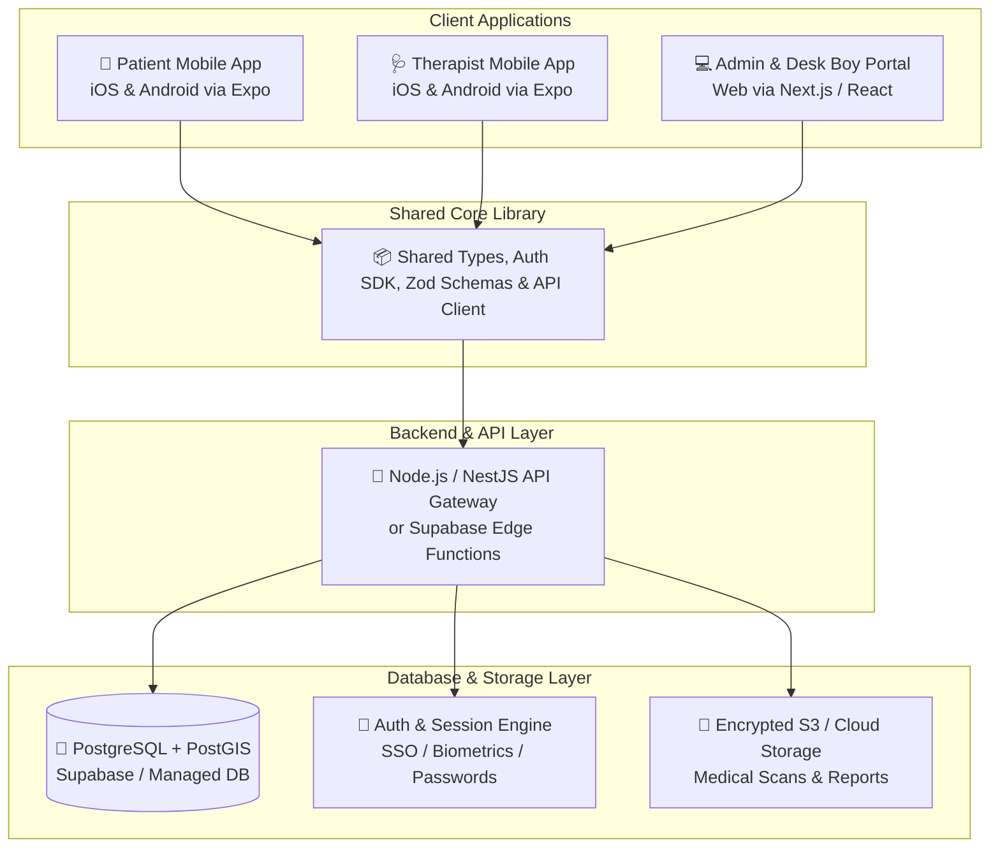

# Application Technology Stack & Multi-Platform Deployment Blueprint
*(Targeting iOS Mobile App, Android Mobile App, and Web Portal)*

> **Core Objective:** Select the single **best, most cost-effective, and easiest-to-deploy technology stack** that allows rapid development of:
> 1. **Patient Mobile App (iOS & Android)**
> 2. **Physiotherapist Mobile App (iOS & Android)**
> 3. **Admin & Desk Boy Web Dashboard (Desktop Web Browser)**  
> **Status:** Planning & Architectural Blueprint (No code implementation until explicitly instructed)

---

## Table of Contents
1. [Executive Comparison of Cross-Platform Frameworks](#1-executive-comparison-of-cross-platform-frameworks)
2. [The Winning Technology Stack Recommendation](#2-the-winning-technology-stack-recommendation)
   - 2.1 Why Expo (React Native) + Next.js / React Web (TypeScript Monorepo) Wins
   - 2.2 Alternative Contender: Flutter Multi-Platform (Dart)
3. [Full-Stack Architecture & Code Sharing Strategy](#3-full-stack-architecture--code-sharing-strategy)
4. [Deployment Strategy & Infrastructure Costs (iOS, Android, Web, Cloud)](#4-deployment-strategy--infrastructure-costs)
   - 4.1 Mobile Deployment (Apple App Store & Google Play Store)
   - 4.2 Web Deployment (Admin & Desk Boy Portal)
   - 4.3 Backend & Database Hosting
5. [Complete Monthly Cost Breakdown ($0 Startup ➔ Scaling)](#5-complete-monthly-cost-breakdown)

---

## 1. Executive Comparison of Cross-Platform Frameworks

To deploy to **all three targets (iOS, Android, and Web)** with maximum speed and minimum cost, we evaluate the 3 leading architectural approaches:

| Dimension | 🥇 Option 1: React Native (Expo) + Next.js (TS Monorepo) | 🥈 Option 2: Flutter (Dart) for Mobile + Web | 🥉 Option 3: Ionic / Capacitor (PWA Wrapper) |
| :--- | :--- | :--- | :--- |
| **Mobile UX (iOS & Android)** | 🟢 **100% Native Performance** & Smooth Maps | 🟢 **100% Native GPU Canvas Rendering** | 🟡 WebView Wrapper (slower maps/animations) |
| **Web UX (Admin / Desk Portal)** | 🟢 **Top-tier Web Experience** (Next.js / Vite, fast SEO & DOM) | 🟡 CanvasKit rendering (heavy initial load for web browsers) | 🟢 Standard Web DOM |
| **Code Sharing Across All 3** | 🟢 **85%+ Code Shared** (TypeScript types, API client, business hooks, Zod validation) | 🟢 **95%+ Code Shared** in Dart | 🟢 90% Code Shared |
| **Cloud Build without Mac** | 🟢 **Expo EAS Build** (Cloud compiles iOS IPA & Android APK for free) | 🟡 Requires GitHub Actions / Codemagic setup | 🟢 Web standard |
| **Ecosystem & Talent** | 🟢 **Largest Ecosystem** (Millions of React/TS libraries, Stripe, Google Maps) | 🟢 Strong Flutter ecosystem | 🟡 Limited to hybrid plugins |
| **Free Tier Deployment** | 🟢 **Vercel / Cloudflare ($0) + Supabase ($0) + EAS ($0)** | 🟢 Firebase / Cloudflare ($0) | 🟢 Web standard |

---

## 2. The Winning Technology Stack Recommendation

### 🏆 Choice A: **React Native (Expo) + Next.js / Vite in a TypeScript Monorepo** (Top Industry Standard)

```
┌────────────────────────────────────────────────────────────────────────────────────────┐
│                        UNIFIED TYPESCRIPT MONOREPO ARCHITECTURE                         │
├────────────────────────────────────────────────────────────────────────────────────────┤
│                                                                                        │
│  apps/                                                                                 │
│   ├── patient-app/         ──► React Native (Expo) for iOS & Android (SSO + Biometrics)│
│   ├── therapist-app/       ──► React Native (Expo) for iOS & Android (GPS + Navigation)│
│   └── admin-web-portal/    ──► Next.js / Tailwind CSS for Admin & Desk Boy Dispatch    │
│                                                                                        │
│  packages/ (Shared Code - 100% Reusable)                                               │
│   ├── api-client/          ──► Auto-generated API hooks & WebSocket listeners          │
│   ├── database-types/      ──► PostgreSQL schema types & validation rules (Zod)        │
│   └── ui-kit/              ──► Shared design tokens, colors, & typography              │
│                                                                                        │
└────────────────────────────────────────────────────────────────────────────────────────┘
```

#### Why This Stack is the Best, Cheapest & Easiest:
1. **Single Language Across Everything (TypeScript):**
   - Frontend Mobile, Frontend Web, Backend APIs, and Database queries all share the exact same language (`TypeScript`).
   - If a booking data model changes, it updates across iOS, Android, and Web instantly with zero type errors.
2. **Zero-Friction iOS Cloud Builds (No Mac Required Initially):**
   - Using **Expo Application Services (EAS)**, you can build iOS `.ipa` and Android `.apk / .aab` bundles directly in the cloud for free with a single command: `eas build --platform all`.
3. **Best Web Performance for Admin & Desk Boy:**
   - Next.js / Vite provides instant page loads, snappy keyboard shortcuts, and responsive data tables for front-desk operators.
4. **Native Mobile Plugins Ready Out-of-the-Box:**
   - Native Apple/Google SSO (`expo-apple-authentication`, `@react-native-google-signin`).
   - Native Biometrics (`expo-local-authentication` for Face ID / Fingerprint).
   - High-performance maps & background GPS tracking (`react-native-maps`, `expo-location`).

---

### 🥈 Choice B: **Flutter Multi-Platform (Dart)** (Strong Contender)

If you prefer a single framework where literally 95%+ of the visual UI widgets are identical across iOS, Android, and Web:
- **Framework:** **Flutter (Dart 3.x)**.
- **State Management:** **Riverpod** or **Bloc**.
- **Pros:** Completely unified UI rendering engine; identical button, map, and animation behavior everywhere.
- **Trade-off:** Flutter Web compiles to CanvasKit/Wasm, which has a slightly larger initial download size (~2-3 MB) on web browsers compared to lightweight React Web.

---

## 3. Full-Stack Architecture & Code Sharing Strategy



---

## 4. Deployment Strategy & Infrastructure Costs

### 4.1 Mobile Deployment (Apple App Store & Google Play Store)
- **Build Tool:** **Expo EAS (Expo Application Services)**
  - **Android:** Generates signed `.aab` (Android App Bundle) ready to upload to Google Play Console.
  - **iOS:** Generates signed `.ipa` ready for Apple TestFlight and Apple App Store.
  - **Over-The-Air (OTA) Updates:** Fix bugs and update UI instantly without waiting for Apple/Google app store re-review via `eas update`.
- **Store Fees (One-time / Annual):**
  - Google Play Developer Account: **$25 (One-time lifetime fee)**.
  - Apple Developer Program: **$99 / year**.

---

### 4.2 Web Deployment (Admin & Desk Boy Portal)
- **Hosting Platform:** **Vercel** or **Cloudflare Pages**
  - **Deployment Speed:** Instant auto-deploy on every `git push` to your GitHub repository.
  - **Global CDN:** Fast access with SSL/HTTPS certificates automatically generated.
  - **Cost:** **$0 / month (100% Free Hobby/Pro tier covers initial operations)**.

---

### 4.3 Backend & Database Hosting
- **Database:** **PostgreSQL + PostGIS via Supabase**
  - **Cost:** **$0 / month** (500 MB database, 50,000 monthly active users, database backups).
- **Backend API Server:** **Render.com / Railway.app / Hetzner Cloud VPS**
  - **Cost:**
    - *Option A (PaaS):* **Render / Railway ($0 to $7 / month)** – Zero server management.
    - *Option B (Self-Hosted VPS):* **Hetzner Cloud VPS ($4.50 / month)** – Runs Docker containers with unlimited bandwidth.

---

## 5. Complete Monthly Cost Breakdown ($0 Startup ➔ Scaling)

```
┌────────────────────────────────────────────────────────────────────────────────────────┐
│                          PROJECTED INFRASTRUCTURE MONTHLY COST                         │
├───────────────────────────────┬───────────────────────────┬────────────────────────────┤
│ Component                     │ Phase 1: MVP / Launch     │ Phase 2: Growth (1k+ Users)│
├───────────────────────────────┼───────────────────────────┼────────────────────────────┤
│ 📱 **Mobile App Builds**      │ **$0** (Expo Free Tier)   │ **$0 – $29/mo** (EAS Pro)  │
│ 💻 **Web Portal Hosting**     │ **$0** (Vercel/Cloudflare)│ **$0 – $20/mo**            │
│ 🐘 **PostgreSQL + PostGIS**   │ **$0** (Supabase Free)    │ **$25/mo**                 │
│ 🚀 **Backend API Server**     │ **$0 – $7/mo** (Render)   │ **$7 – $25/mo**            │
│ 🗺️ **Maps & Routing (Google)**│ **$0** ($200 free credit) │ **$0 – $30/mo**            │
│ 💬 **Push Notifications**     │ **$0** (Firebase FCM/APNs)│ **$0** (Free unlimited)    │
├───────────────────────────────┼───────────────────────────┼────────────────────────────┤
│ **TOTAL ESTIMATED MONTHLY**   │ **~$0 to $7 / month**     │ **~$50 to $100 / month**   │
└───────────────────────────────┴───────────────────────────┴────────────────────────────┘
```

---

> [!IMPORTANT]
> **Planning Confirmation:**  
> This technology stack guarantees:  
> 1. **True Cross-Platform Coverage:** One codebase covers iOS, Android, and Desktop Web.  
> 2. **Lowest Possible Cost:** Deploy and test the entire system for virtually **$0 to $7/month**.  
> 3. **Fastest Time to Market:** Expo EAS eliminates local Mac build headaches.  
> We remain strictly in the **Planning Phase**. Implementation will begin only upon your next instruction.
