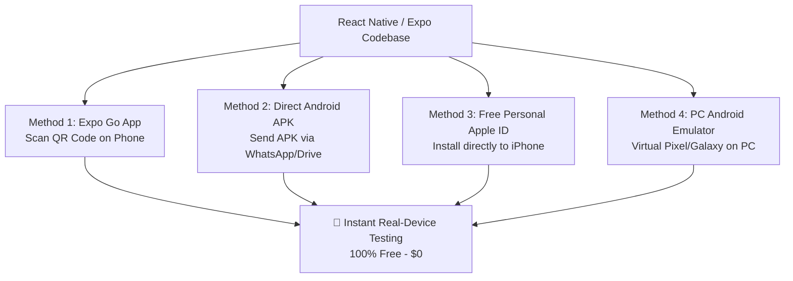

# Free Mobile App Testing Guide
*(Testing on Real iPhones, Android Phones & Emulators with $0 Accounts)*

> **Core Answer:** **YES! You can develop, run, test, and share the complete mobile application on physical iPhones, Android devices, and emulators 100% for FREE with ZERO ($0) Apple or Google developer accounts.**

---

## 4 Free Methods to Test Mobile Apps Without Store Accounts



---

### Method 1: Expo Go App (Fastest & Easiest for iPhone & Android)
* **Cost:** **$0 (100% Free)**
* **No Accounts Needed:** No Apple Developer account ($99) and no Google Play account ($25).

#### How it works:
1. Download the free **Expo Go** app from:
   - [Apple App Store](https://apps.apple.com/app/expo-go/id982107779) on your iPhone.
   - [Google Play Store](https://play.google.com/store/apps/details?id=host.exp.exponent) on your Android phone.
2. In your project terminal, run:
   ```bash
   npx expo start
   ```
3. A QR code appears in your terminal.
4. **On iPhone:** Open the regular Camera app and scan the QR code ➔ App opens instantly inside Expo Go.
5. **On Android:** Open the Expo Go app and scan the QR code ➔ App opens instantly.
6. **Live Reloading:** Any change you make to the code updates on your phone screen in under 1 second!

---

### Method 2: Direct Android APK Sideloading (Android)
* **Cost:** **$0 (100% Free)**
* **No Accounts Needed:** You can share the installable app with anyone (family, friends, therapists) without Google Play Console.

#### How it works:
1. Generate a standalone `.apk` install file for free.
2. Send the `physio-app.apk` file via WhatsApp, Email, or Google Drive to any Android phone.
3. The user taps the file, clicks **"Install"**, and the full native app installs on their Android home screen just like an app from the Play Store.

---

### Method 3: Free Personal Apple ID Sideloading (iPhone)
* **Cost:** **$0 (100% Free)**
* **No Paid Apple Developer Account Needed:**

#### How it works:
- Apple allows anyone with a standard free personal Apple ID (the everyday email you use on your iPhone) to install and run your own apps directly on your physical iPhone via USB using Xcode / iOS development tools.
- Runs with full native hardware access (Camera, GPS, Face ID).

---

### Method 4: Virtual Emulators on Your PC / Laptop
* **Cost:** **$0 (100% Free)**

#### How it works:
- **Android Studio Emulator:** Run a virtual Google Pixel or Samsung Galaxy phone directly on your Windows PC screen for testing different screen sizes, GPS locations, and network drop scenarios.
- **Web Browser Mobile Mode:** Press `w` in your terminal to open the mobile app in Google Chrome / Microsoft Edge with responsive mobile view and Chrome DevTools.

---

## When Do You Actually Need the Paid Accounts?

```
┌────────────────────────────────────────────────────────────────────────────────────────┐
│                        FREE TESTING VS. PAID STORE PUBLISHING                          │
├───────────────────────────────────────────────────────┬────────────────────────────────┤
│ What You Can Do for 100% FREE ($0):                  │ What Requires Paid Accounts:   │
├───────────────────────────────────────────────────────┼────────────────────────────────┤
│ ✅ Test on your own iPhone and iPad                   │ ❌ Publishing publicly on the  │
│ ✅ Test on any physical Android phone                 │    Apple App Store (Global)    │
│ ✅ Share standalone APK with therapists & testers     │ ❌ Publishing publicly on the  │
│ ✅ Test Google Sign-In, Maps, and Biometrics          │    Google Play Store (Global)  │
│ ✅ Test real-time GPS tracking and live booking flows │                                │
│ ✅ Run virtual Android emulators on your PC           │                                │
└───────────────────────────────────────────────────────┴────────────────────────────────┘
```

> [!NOTE]
> **Summary:** You can complete the entire development, design, and end-to-end testing of both the Patient App, Therapist App, and Admin Web Portal for **$0**. You only pay Apple ($99) or Google ($25) on the day you are ready to launch publicly to the world.
