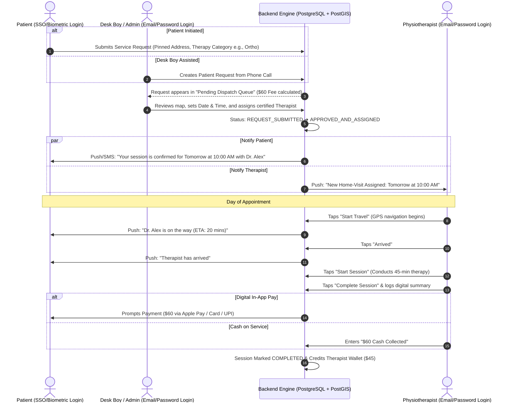
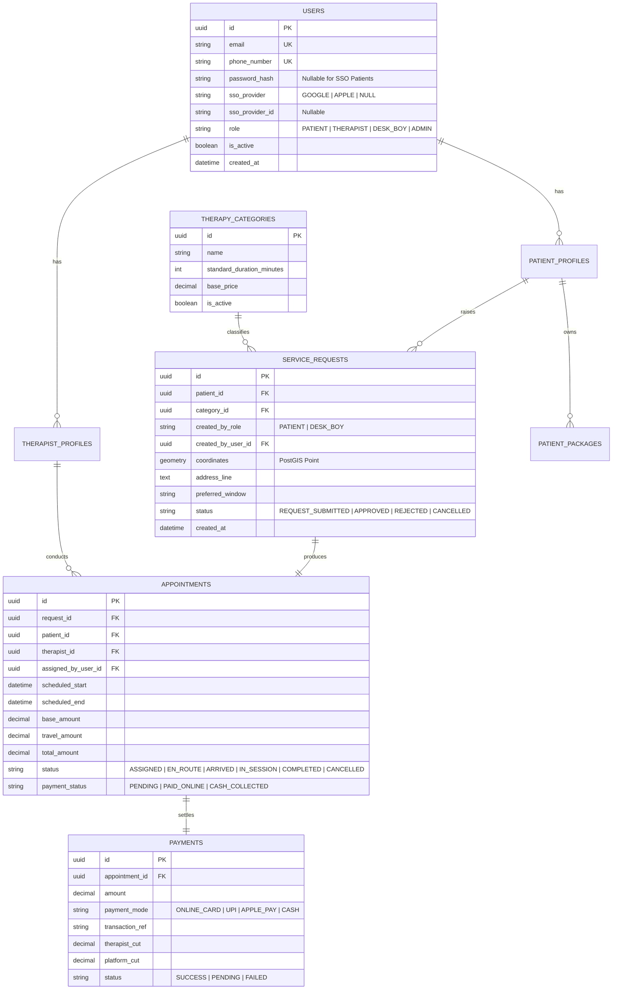

# Phase 1 Specification: Centralized In-Home Physiotherapy Platform
*(With Extensible Architecture for Future In-Clinic Center Expansion)*

> **Target Platforms:** Cross-Platform Mobile (iOS & Android) for Patients & Therapists + Web Admin / Desk Boy Dispatch Portal  
> **Core Operating Model:** **Centralized Request-Review-Dispatch Model**  
> *(Patients/Desk Boys raise requests ➔ Admins/Desk Boys approve, schedule date/time, and assign therapists)*  
> **Status:** Planning & Architecture Design (No implementation until explicitly instructed)

---

## Table of Contents
1. [Database Evaluation: Best & Most Cost-Effective Choice](#1-database-evaluation-best--most-cost-effective-choice)
   - 1.1 Key Database Requirements for This Application
   - 1.2 Top Database Candidates Comparison (Features & Pricing)
   - 1.3 Recommended Database & Hosting Architecture
2. [Authentication, Login & Security Architecture](#2-authentication-login--security-architecture)
   - 2.1 Patient Mobile App Auth (SSO + Biometrics)
   - 2.2 Staff & Provider Auth (Admin, Desk Boy, Therapist - Email & Password)
   - 2.3 Role-Based Access Control (RBAC) Matrix
3. [Therapy Catalog & Comprehensive Pricing / Payment Structure](#3-therapy-catalog--comprehensive-pricing--payment-structure)
   - 3.1 Therapy Categories & Tiered Pricing Matrix
   - 3.2 Dynamic Fee Calculation Formula (Base + Distance + Seniority)
   - 3.3 Multi-Session Care Packages & Subscriptions
   - 3.4 Payment Collection Modes & Timing (Pre-pay, Post-session, Cash)
   - 3.5 Revenue Split & Therapist Payout Structure
4. [User Roles & Permissions Matrix](#4-user-roles--permissions-matrix)
5. [End-to-End Service Lifecycle (Request ➔ Review ➔ Dispatch ➔ Execution)](#5-end-to-end-service-lifecycle)
6. [Component & Feature Breakdown](#6-component--feature-breakdown)
   - 6.1 Patient Mobile App (iOS & Android)
   - 6.2 Desk Boy / Front-Desk Coordinator Web Portal
   - 6.3 Super Admin Management Dashboard (Web)
   - 6.4 Physiotherapist Mobile App (iOS & Android)
7. [Database Schema & State Machine](#7-database-schema--state-machine)
8. [Future Expansion: Center / In-Clinic Readiness](#8-future-expansion-center--in-clinic-readiness)

---

## 1. Database Evaluation: Best & Most Cost-Effective Choice

### 1.1 Key Database Requirements for This Application
1. **Geospatial Queries (GIS):** Must calculate distances between patient coordinates and therapists' service radii efficiently (`ST_DWithin`, distance matrix).
2. **ACID Financial & Relational Integrity:** Must prevent double-booking, calculate accurate commission splits, track package balances, and maintain immutable audit trails.
3. **Cost Efficiency & Free Tier:** Low/zero startup cost ($0/month during development & launch) with predictable, budget-friendly scaling ($5–$25/month).

---

### 1.2 Top Database Candidates Comparison

| Database Option | Type | Geospatial (GPS) Support | Relational / ACID Integrity | Monthly Cost (Free Tier & Scaling) | Verdict |
| :--- | :--- | :---: | :---: | :--- | :---: |
| **PostgreSQL + PostGIS** *(via Supabase or Neon)* | Relational SQL | 🟢 **Industry Gold Standard** (Native PostGIS) | 🟢 **100% Strict ACID & Foreign Keys** | • **Free Tier:** $0/mo (500MB DB, 50k monthly active users, Auth included)<br>• **Scale:** $25/mo Pro plan (8GB+ storage, automated backups) | 🌟 **#1 BEST & CHEAPEST (Recommended)** |
| **PostgreSQL Self-Hosted** *(via Hetzner / DigitalOcean VPS)* | Relational SQL | 🟢 **Industry Gold Standard** (Native PostGIS) | 🟢 **100% Strict ACID & Foreign Keys** | • **Flat Cost:** $4 to $6/mo for 2GB RAM, 40GB NVMe SSD, unlimited queries. | 🟢 **Cheapest for Full Control** |
| **MongoDB Atlas** | NoSQL Document | 🟡 Moderate (`2dsphere` indexes) | 🔴 Weak relational joins (risk of data mismatch in ledger/payouts) | • **Free Tier:** $0/mo (512MB shared)<br>• **Scale:** $9–$57/mo | 🟡 Not ideal for multi-party financial transactions |
| **Firebase Firestore** | NoSQL Document | 🔴 Poor (Requires complex Geohash workarounds) | 🔴 No SQL joins; complex atomic transactions across 4 entities | • **Free Tier:** $0/mo (50k reads/day)<br>• **Scale:** Pay-per-read/write (can become expensive quickly) | ❌ Inefficient & costly for spatial dispatch |

---

### 1.3 Recommended Database & Hosting Architecture

#### 🏆 Top Recommendation: **PostgreSQL + PostGIS (via Supabase or Managed PostgreSQL)**

```
┌────────────────────────────────────────────────────────────────────────────────────────┐
│               WHY POSTGRESQL + POSTGIS IS THE BEST & CHEAPEST OPTION                   │
├────────────────────────────────────────────────────────────────────────────────────────┤
│ 1. 📍 Built-in PostGIS: Calculates exact distance between patient home and therapist   │
│    in a single microsecond SQL query (e.g., ST_Distance, ST_DWithin).                  │
│ 2. 💰 $0 Free Tier to Start: Free 500MB database, built-in Auth, and real-time events. │
│ 3. 🔒 Financial Grade: Exact penny-accurate ledgers for payouts, commission, & cash.   │
│ 4. 📈 Predictable Scaling: Upgrading costs just $5–$25/month as patient volume grows.  │
└────────────────────────────────────────────────────────────────────────────────────────┘
```

---

## 2. Authentication, Login & Security Architecture

```mermaid
graph TD
    subgraph Unified Auth Gateway
        GW[JWT Token Issuer & Session Manager]
    end

    subgraph Consumer Mobile App
        Patient[Patient App - iOS & Android]
        Patient -->|1. SSO: Google Sign-In / Apple ID<br>2. Biometrics: FaceID / Fingerprint| GW
    end

    subgraph Staff & Healthcare Provider Applications
        Admin[Super Admin Portal - Web]
        Desk[Desk Boy Dispatcher - Web]
        PT[Therapist App - iOS & Android]

        Admin -->|Email + Password| GW
        Desk -->|Email + Password| GW
        PT -->|Email + Password<br>(Requires Admin Approval)| GW
    end
```

### 2.1 Patient Mobile App Auth (SSO + Biometrics)
- **Single Sign-On (SSO):** **Apple Sign-In** (iOS) and **Google Sign-In** (Android/iOS).
- **Biometric Security Layer:** Face ID / Touch ID (iOS) and BiometricPrompt (Android).
- **Assisted Patient Linking:** When a Desk Boy enters a request over phone, user records automatically link upon the patient's first SSO login.

### 2.2 Staff & Provider Auth (Admin, Desk Boy, Therapist - Email & Password)
- **Physiotherapist Mobile App:** Email & Password + Admin Approval Gate.
- **Desk Boy Dispatch Portal:** Email & Password (scoped to dispatch operations).
- **Super Admin Dashboard:** Email & Password (+ Rate-limiting, brute-force protection).

### 2.3 Role-Based Access Control (RBAC) Matrix

| User Role | Auth Method | Interface | Raise Request | Schedule & Assign PT | View Financials & Payouts | Mark Session Done |
| :--- | :--- | :--- | :---: | :---: | :---: | :---: |
| **PATIENT** | **SSO + Biometrics** | Mobile App | ✅ (Own/Family) | ❌ | ❌ (Own Invoices) | ❌ |
| **THERAPIST** | **Email & Password** | Mobile App | ❌ | ❌ | ⚠️ (Own Earnings) | ✅ |
| **DESK_BOY** | **Email & Password** | Web Portal | ✅ (For any caller) | ✅ | ❌ | ❌ |
| **SUPER_ADMIN** | **Email & Password** | Web Dashboard | ✅ | ✅ | ✅ | ✅ |

---

## 3. Therapy Catalog & Comprehensive Pricing / Payment Structure

### 3.1 Therapy Categories & Tiered Pricing Matrix

| Therapy Category | Target Conditions | Standard Duration | Base Home Visit Fee (USD / INR Example) | Included Modalities |
| :--- | :--- | :---: | :---: | :--- |
| **1. Orthopedic & Spine Care** | Back pain, neck stiffness, sciatica, frozen shoulder. | **45 Mins** | **$45 / ₹800** | Manual therapy, IFT/TENS, ultrasound, therapeutic exercise. |
| **2. Post-Surgical & Joint Replacement** | Knee replacement (TKR), hip replacement (THR), ACL rehab. | **60 Mins** | **$60 / ₹1,200** | Gait training, CPM assistance, scar mobilization. |
| **3. Neurological Rehabilitation** | Stroke (Hemiplegia), Parkinson's, Spinal Cord Injury. | **60–75 Mins** | **$75 / ₹1,500** | NDT, balance & proprioceptive re-education. |
| **4. Sports Injury & Performance Rehab** | Rotator cuff tears, sprains, tennis elbow. | **60 Mins** | **$65 / ₹1,300** | Kinesio taping, dry needling, sports conditioning. |
| **5. Geriatric & Fall Prevention Care** | Elderly mobility, balance disorders, generalized weakness. | **45 Mins** | **$50 / ₹900** | Balance assessment, fall prevention exercises. |
| **6. Cardiopulmonary & Chest PT** | Post-COVID recovery, COPD, chest congestion. | **45 Mins** | **$55 / ₹1,100** | Chest percussion, postural drainage, spirometry. |
| **7. Pediatric Physiotherapy** | Delayed motor milestones, torticollis, cerebral palsy. | **45–60 Mins** | **$65 / ₹1,300** | Sensory integration, motor facilitation. |

---

### 3.2 Dynamic Fee Calculation Formula

$$\text{Final Total Fee} = \text{Base Category Fee} + \text{Travel Surcharge} + \text{Therapist Seniority Tier} + \text{Express Surcharge}$$

1. **Base Category Fee:** Fixed per therapy category (Table 3.1).
2. **Travel Distance Surcharge:**
   - **0 to 5 km from Therapist Base:** **$0.00 (Included in Base Fee)**
   - **Beyond 5 km:** **+$1.50 / ₹30 per additional km**
3. **Therapist Seniority Tier:**
   - *Junior PT (1–3 yrs experience):* Base Rate
   - *Senior PT (4–8 yrs experience):* +15%
   - *Master Consultant (8+ yrs experience):* +30%

---

### 3.3 Multi-Session Care Packages & Subscriptions

- 🟢 **Starter Plan (5 Sessions):** 10% Discount (Acute Sprains & Back Pain)
- 🔵 **Recovery Plan (10 Sessions):** 18% Discount (Post-Surgical Rehab)
- 🟣 **Full Rehab Pass (20 Sessions):** 25% Discount (Stroke / Neuro Rehab)

---

### 3.4 Payment Collection Modes & Timing

1. **Pre-Payment Online:** Paid via Cards, UPI, NetBanking, Apple Pay, Google Pay once Admin/Desk Boy approves schedule.
2. **Post-Session Digital Pay:** Paid via an in-app payment link or QR code immediately after session completion.
3. **Cash on Service (COS):** Paid physically to therapist; therapist logs cash in mobile app.
4. **Revenue Split:** Configurable (e.g., 75% to Therapist, 25% Platform Commission) with automated weekly direct bank payouts.

---

## 4. User Roles & Permissions Matrix

| Role | Primary Interface | Auth Method | Key Capabilities |
| :--- | :--- | :--- | :--- |
| **Patient / Customer** | Mobile App (iOS & Android) | **SSO (Google / Apple) + Biometrics** | • Raise home visit service request.<br>• Track approval and assigned therapist details.<br>• Track live therapist ETA on visit day.<br>• Make payments and view treatment notes. |
| **Desk Boy / Care Coordinator** | Web Dispatch Portal | **Email & Password** | • Create requests for phone/walk-in patients.<br>• Review request queue on map.<br>• **Set confirmed Date & Time and assign therapist.** |
| **Super Admin** | Web Management Dashboard | **Email & Password** | • Configure pricing, travel fees, and payouts.<br>• Verify and onboard therapists.<br>• System financial reports and branch management. |
| **Physiotherapist** | Mobile App (iOS & Android) | **Email & Password** | • View assigned home visits.<br>• Update status: *Start Travel* ➔ *Arrived* ➔ *In Session* ➔ *Completed*.<br>• Log clinical summary & record cash collected. |

---

## 5. End-to-End Service Lifecycle



---

## 6. Component & Feature Breakdown

### 6.1 Patient Mobile App (iOS & Android)
- **Login:** Google Sign-In, Apple Sign-In, Face ID / Fingerprint.
- **Request Form:** Pinned GPS location, selected therapy category, symptoms description, and preferred timing window.
- **Assigned Appointment Hub:** View confirmed date & time, assigned therapist's photo, degree, verified badge, and contact masking.
- **Live Travel Tracker:** Real-time ETA banner when therapist is en route.
- **Package Tracker:** View active multi-session pass credits and expiry dates.

### 6.2 Desk Boy / Front-Desk Coordinator Web Portal
- **Call-Intake Quick Booking:** Create new patient requests in under 30 seconds for phone callers.
- **Visual Dispatch Board:** Map of patient locations overlaid with real-time therapist GPS locations.
- **Appointment Scheduler:** Pick exact start and end times, assign therapist, and select payment mode.

### 6.3 Super Admin Management Dashboard (Web)
- **Pricing & Fee Master:** Set base prices for all 7 therapy categories, configure per-km travel surcharges, and bundle discounts.
- **Therapist Onboarding:** Upload license documents, verify certificates, set commission percentage, and configure active service radius.
- **Financial Ledger:** Track total bookings, cash collections, platform revenue, and one-click weekly therapist payouts.

### 6.4 Physiotherapist Mobile App (iOS & Android)
- **Daily Dispatch Schedule:** Chronological list of assigned home visits for Today and Upcoming days.
- **Navigation:** One-tap redirect to Google Maps / Apple Maps.
- **Session Actions:** *Start Travel* ➔ *Arrived* ➔ *Start Session* ➔ *Complete Session*.
- **Cash Reconciliation:** Report cash received from patients to balance earnings wallet.

---

## 7. Database Schema & State Machine



---

## 8. Future Expansion: Center / In-Clinic Readiness

1. **Single Schema Foundation:** Both In-Home and Center visits share the exact same `users`, `therapy_categories`, and `payments` tables.
2. **Phase 2 Center Switch:** When centers are opened:
   - Desk Boy can choose to assign a therapist to travel to the patient's home OR assign a slot/bed at a physical clinic branch.
   - Patient app displays a tab to choose between "Book Home Visit" and "Book at Center".

---

> [!IMPORTANT]
> **Planning Confirmation:**  
> This specification documents:  
> 1. **The recommended & cheapest database:** PostgreSQL + PostGIS (via Supabase / Neon / VPS).  
> 2. **Authentication:** SSO/Biometrics for Patients, Email & Password for Staff.  
> 3. **Therapy pricing, dispatch lifecycle, and data schemas.**  
> We remain in the **Planning Phase**.
