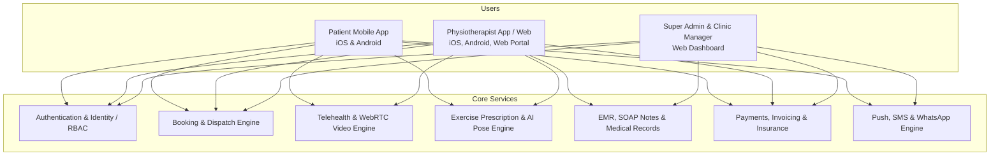
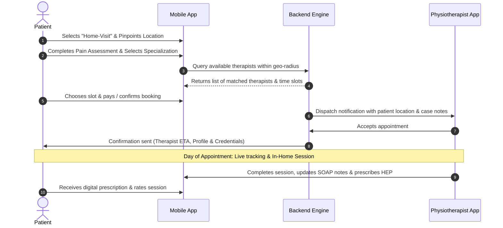
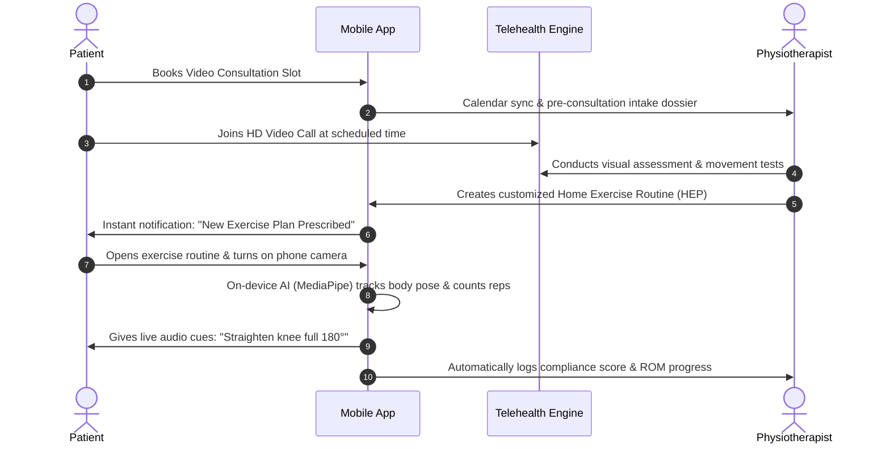
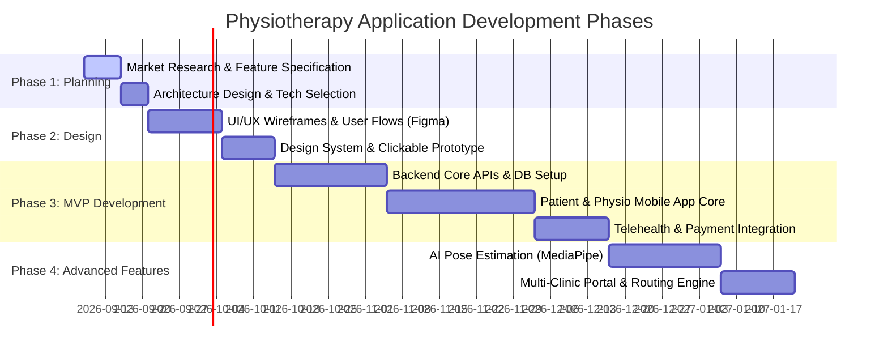

# Physiotherapy Mobile Application: Market Analysis, Competitive Research & Architectural Planning

> **Project Phase:** Phase 1 – Market Analysis & Strategic Blueprint  
> **Target Platforms:** Cross-Platform Mobile (iOS & Android) + Web Admin / Provider Dashboards  
> **Status:** Planning & Specification (No implementation until explicitly requested)

---

## Table of Contents
1. [Executive Summary & Industry Overview](#1-executive-summary--industry-overview)
2. [Market Analysis & Competitive Landscape](#2-market-analysis--competitive-landscape)
   - 2.1 Direct & Indirect Competitor Breakdown
   - 2.2 Detailed Feature Comparison Matrix
   - 2.3 Market Gaps & Strategic Differentiators
3. [End-to-End Functional Architecture & Feature Breakdown](#3-end-to-end-functional-architecture--feature-breakdown)
   - 3.1 Patient Mobile Application (iOS & Android)
   - 3.2 Physiotherapist / Care Provider Portal
   - 3.3 Clinic & Super Admin Management System
4. [Care Delivery Modes & Core User Journeys](#4-care-delivery-modes--core-user-journeys)
   - 4.1 Care Delivery Models (In-Clinic, Home-Visit, Virtual Tele-Rehab)
   - 4.2 Comprehensive Workflow & User Journey Maps
5. [Technical Architecture & Technology Stack Recommendations](#5-technical-architecture--technology-stack-recommendations)
   - 5.1 Mobile App Frameworks (Flutter vs. React Native)
   - 5.2 Backend, Real-Time & AI Infrastructure
   - 5.3 Health Data Compliance & Security (HIPAA, GDPR, E2EE)
6. [Monetization & Business Models](#6-monetization--business-models)
7. [Phased Roadmap & Next Steps](#7-phased-roadmap--next-steps)

---

## 1. Executive Summary & Industry Overview

The global digital physical therapy and rehabilitation market is undergoing rapid transformation, fueled by rising musculoskeletal (MSK) conditions, aging demographics, post-surgical recovery needs, and the shift toward on-demand hybrid healthcare.

### Key Market Trends:
- **Hybrid Care Delivery:** Modern patients demand flexibility—booking in-clinic sessions, requesting certified therapists for in-home visits, or consulting virtually via high-definition video.
- **AI-Powered Movement & Pose Estimation:** Integration of computer vision (e.g., Google MediaPipe, MoveNet) directly on mobile devices to evaluate patient range of motion (ROM), count repetitions, and correct posture in real-time without bulky hardware.
- **Continuous Remote Therapeutic Monitoring (RTM):** Transition from isolated 1-hour appointments to continuous care models with daily digital Home Exercise Programs (HEP), pain diaries, and automated therapist check-ins.
- **Automated Scheduling & Intelligent Dispatch:** Reducing administrative overhead and cancellations through automated booking, buffer-time calculations for traveling therapists, and automated calendar syncing.

---

## 2. Market Analysis & Competitive Landscape

### 2.1 Direct & Indirect Competitor Breakdown

| Competitor | Primary Category | Operating Model | Strengths | Limitations |
| :--- | :--- | :--- | :--- | :--- |
| **Luna On-Demand** | On-Demand In-Home PT | Matches patients with licensed PTs who deliver care in the patient's home. | Auto-charting, seamless insurance handling, concierge scheduling. | Primarily focused on in-home visits; limited self-guided AI exercises. |
| **Hinge Health** | Digital MSK Platform | Employer-sponsored virtual therapy and coaching. | Wearable motion sensors, dedicated care team, comprehensive lifestyle coaching. | Closed B2B employer ecosystem; not accessible directly to retail consumers. |
| **Physitrack / PhysiApp** | Practice & Patient Tele-Rehab | Software for clinics/physiotherapists to prescribe exercises & conduct telehealth. | 15,000+ clinical exercise videos, remote outcomes tracking, EHR integrations. | Relies on existing patient-clinic relationships; no public consumer marketplace. |
| **Kaia Health** | AI Computer Vision MSK | App-based therapy using smartphone camera for real-time biofeedback. | Zero hardware needed; instant computer vision feedback on exercise form. | Purely virtual/self-guided; limited hands-on physical therapy integration. |
| **Practo / Zocdoc** | General Healthcare Marketplace | Search directory and appointment booking for clinics and doctors. | High brand discovery, instant verified reviews, wide geographical coverage. | Lacks physiotherapy-specific features (exercise builders, ROM tracking, SOAP body charts). |

---

### 2.2 Detailed Feature Comparison Matrix

| Feature / Capability | Luna | Hinge Health | Physitrack | Kaia Health | Standard Marketplaces (Practo/Zocdoc) | **Our Proposed Platform** |
| :--- | :---: | :---: | :---: | :---: | :---: | :---: |
| **In-Clinic Booking** | ❌ | ❌ | ⚠️ (Partnered) | ❌ | ✅ | ✅ **Full Support** |
| **Home-Visit Booking (At-Home PT)** | ✅ | ❌ | ❌ | ❌ | ⚠️ (Limited) | ✅ **Full Support (with route optimization)** |
| **Virtual Teleconsultation (HD Video)** | ⚠️ | ✅ | ✅ | ✅ | ✅ | ✅ **Interactive Telehealth + Whiteboard** |
| **Prescription Home Exercise Program (HEP)** | ⚠️ | ✅ | ✅ | ✅ | ❌ | ✅ **1,000+ Exercise Video Library** |
| **AI Smartphone Camera Pose/Form Tracking** | ❌ | ⚠️ (Sensors) | ❌ | ✅ | ❌ | ✅ **On-Device Computer Vision (MediaPipe)** |
| **Multi-Session Rehab Packages** | ✅ | ✅ | ✅ | ❌ | ⚠️ | ✅ **Package Tracking & Milestones** |
| **Interactive Pain Body Mapping** | ⚠️ | ⚠️ | ✅ | ✅ | ❌ | ✅ **3D/2D Visual Pain & ROM Map** |
| **Clinical SOAP Notes & Body Charting** | ✅ | ✅ | ✅ | ❌ | ❌ | ✅ **Integrated Digital EMR for Physios** |
| **In-App Direct Chat & Voice Notes** | ✅ | ✅ | ✅ | ✅ | ⚠️ | ✅ **Secure HIPAA/GDPR Compliant Chat** |
| **Multi-Tier Payment & Insurance Support** | ✅ | ✅ (B2B) | ⚠️ | ❌ | ✅ | ✅ **Cards, UPI/Wallets, Insurance Claims** |

---

### 2.3 Market Gaps & Strategic Differentiators

1. **True Unified "Trio-Care" Model:** Most apps are either strictly marketplaces (Zocdoc), strictly in-home agencies (Luna), or strictly self-guided apps (Kaia). Providing a single unified app where a patient can toggle between **In-Clinic**, **Home-Visit**, and **Virtual Tele-Rehab** creates maximum retention.
2. **Accessible AI Form Correction Without Hardware:** Eliminating expensive external sensor bands by leveraging camera-based real-time pose tracking.
3. **Session Continuity & Recovery Score:** Providing gamified progress tracking, visual pain curves, and range-of-motion improvement charts that keep patients motivated throughout their multi-week rehabilitation.
4. **Physiotherapist-First Operational Tools:** Rapid voice-to-text SOAP note charting, visual anatomical annotation, and automated travel buffer management for home visits.

---

## 3. End-to-End Functional Architecture & Feature Breakdown



---

### 3.1 Patient Mobile Application (iOS & Android)

#### A. Onboarding, Health Profile & Triage
- **Smart Onboarding & Authentication:** Email, Phone OTP, Social Login (Google, Apple ID), Biometric login (FaceID / Fingerprint).
- **Interactive Body Pain Mapping:** 3D/2D anatomical human model allowing users to tap specific areas (e.g., cervical spine, rotator cuff, lumbar, knee, ankle) and rate pain intensity (VAS Scale 1–10).
- **Pre-Consultation Clinical Triage:** Questionnaire detailing injury onset (acute vs. chronic), post-surgical status, mobility restrictions, medical history, and existing doctor referrals.
- **Medical Record Vault:** Upload and store MRI scans, X-rays, doctor prescriptions, and prior discharge summaries.

#### B. Discovery, Search & Multi-Mode Booking Engine
- **Care Mode Selection:**
  - 🏥 **In-Clinic Visit:** Search nearby accredited physiotherapy clinics and pick specialized slots.
  - 🏠 **Home-Visit (At-Home Care):** Request a verified therapist to visit the user’s residence.
  - 💻 **Virtual Consultation (Tele-PT):** Instant or scheduled high-definition video session.
- **Smart Filtering & Matching:** Filter by specialty (Orthopedic, Sports Rehab, Neurological, Pediatric, Geriatric, Pelvic Health, Cardiopulmonary), gender preference, distance, ratings, price range, spoken languages.
- **Real-Time Calendar & Slot Booking:** Dynamic calendar showing available morning/afternoon/evening slots, recurring appointment scheduling, and instant hold with countdown timer.
- **Multi-Session Packages:** Book 5, 10, or 20-session recovery packages with bundle discounts and automated session countdown trackers.

#### C. Telehealth & Real-Time Virtual Consultations
- **HD WebRTC Video Consultations:** Low-latency, encrypted 1-on-1 video calling with screen sharing.
- **Dual-Camera & Split View:** Allows the therapist to demonstrate an exercise on one side while viewing the patient's execution on the other.
- **Live Session Annotation:** Real-time on-screen pointers and angles to guide patient movement during live video calls.

#### D. Home Exercise Program (HEP) & AI Form Correction
- **Daily Prescribed Routine Dashboard:** Clear daily task list showing assigned exercises, sets, reps, and hold times.
- **4K Clinical Exercise Library:** High-definition video demonstrations with multi-angle views, audio guidance, and precautions.
- **AI Smartphone Camera Pose Tracking:**
  - Real-time skeleton landmark detection via phone front camera.
  - Automated repetition counting and range-of-motion (ROM) degree tracking.
  - Audio and visual corrective cues (e.g., *"Keep your back straight"*, *"Lower your hips further"*).
- **Daily Pain & Compliance Feedback:** Post-exercise feedback submission (effort level, pain during movement) notifying the therapist if pain exceeds safety thresholds.

#### E. Communication, Payments & Notifications
- **In-App Messaging & Media Sharing:** Secure chat with therapist to send updates, short video clips of movement, or questions between sessions.
- **Payment Gateway Integration:** Credit/Debit Cards, UPI, Net Banking, Apple Pay, Google Pay, Stripe/Razorpay.
- **Insurance & Reimbursement Support:** Itemized digital receipts, Superbills, CPT/diagnosis codes generation for easy insurance reimbursement.
- **Smart Reminders:** Push notifications, SMS, WhatsApp alerts for upcoming appointments, daily exercise reminders, and posture check-ins.
- **Emergency / Red Flag Alerts:** Automated prompt to seek urgent medical attention if red-flag symptoms (severe numbness, bladder dysfunction, unmanageable pain) are reported.

---

### 3.2 Physiotherapist / Care Provider Portal

#### A. Provider Onboarding & Credential Verification
- Professional license verification (registration numbers, degree certificates, malpractice insurance).
- Profile builder: Specializations, years of experience, clinic affiliations, bio, and introduction video.

#### B. Schedule, Availability & Travel Logistics
- **Flexible Availability Manager:** Set recurring weekly working hours, vacation blackouts, and custom slot durations (e.g., 30m, 45m, 60m).
- **Home-Visit Travel Radius & Buffer Management:** Set serviceable geo-fenced travel zones and automated travel buffer times (e.g., 30 min transit window) between home appointments.
- **Multi-Location Slot Allocation:** Allocate specific days/hours to different physical clinics.

#### C. Clinical EMR, Body Charting & SOAP Notes
- **Rapid SOAP Notes (Subjective, Objective, Assessment, Plan):** Pre-built templates, drop-downs, and voice-to-text transcription.
- **Visual Anatomical Body Charting:** Draw, annotate, and highlight muscle groups, trigger points, and incision sites directly on a digital body map.
- **Standardized Clinical Outcome Measures:** Digital entry for Oswestry Disability Index (ODI), Neck Disability Index (NDI), Goniometer ROM measurements, and Muscle Power grading (Oxford scale).

#### D. Digital Exercise Prescription Engine
- **Exercise Program Builder:** Search 1,000+ categorized exercises or record custom video instructions for patients.
- Assign sets, repetitions, hold durations, weekly frequency, and rest intervals with drag-and-drop ease.
- **Patient Compliance Dashboard:** Real-time visibility into patient exercise completion rates, reported pain curves, and AI form tracking accuracy.

#### E. Financials, Earnings & Telehealth Tools
- Live earnings overview, completed visits breakdown, commission share, and instant bank payout status.
- Direct in-app tele-consultation room with patient record split-screen view.

---

### 3.3 Clinic & Super Admin Management System

- **Clinic & Facility Management:** Multi-branch setup, room and equipment scheduling, therapist shift assignments.
- **Smart Dispatch & Routing (Home Visits):** Automated or manual assignment of home-visit booking requests to the closest available therapist based on GPS geolocation.
- **Patient CRM & Care Coordinator Dashboard:** Track patient retention, drop-offs, package renewal alerts, and customer support tickets.
- **Billing, Invoicing & Commission Engine:** Automated split payments between platform, clinic, and independent therapists; tax invoicing (GST/VAT).
- **Compliance & Audit Logging:** Detailed access logs for all medical data (HIPAA / GDPR audit compliance), encrypted backups, and data retention policies.
- **Platform Analytics & Reporting:** Cohort analysis, clinician utilization rates, patient satisfaction (CSAT/NPS), tele-rehab session quality metrics.

---

## 4. Care Delivery Modes & Core User Journeys

### 4.1 Care Delivery Models Overview

```
                      ┌────────────────────────────────────────┐
                      │    Physiotherapy Platform (App)        │
                      └──────────────────┬─────────────────────┘
                                         │
         ┌───────────────────────────────┼───────────────────────────────┐
         ▼                               ▼                               ▼
  [ 🏥 In-Clinic ]               [ 🏠 Home-Visit ]              [ 💻 Virtual Tele-PT ]
• Clinic discovery              • GPS-based matching            • Encrypted WebRTC Video
• Room & slot reservation       • Therapist travels to patient  • Split-screen demo & call
• In-person hands-on therapy    • Travel buffer management      • AI exercise prescription
• On-site equipment access      • Safety & arrival check-in     • Remote recovery monitoring
```

---

### 4.2 Comprehensive Workflow & User Journey Maps

#### Journey 1: Booking an At-Home Physiotherapy Session


#### Journey 2: Virtual Telehealth Consultation + AI-Guided Exercise Plan


---

## 5. Technical Architecture & Technology Stack Recommendations

### 5.1 Mobile App Frameworks Comparison (iOS & Android)

| Framework | Performance | Camera / AI Pose Integration | Code Reusability | Verdict for Physiotherapy App |
| :--- | :--- | :--- | :--- | :--- |
| **Flutter (Dart)** | 🟢 Native compiled (60/120 FPS), smooth animations | 🟢 Excellent via native C++/Dart bindings (MediaPipe, TFLite) | 🟢 95%+ unified code across iOS & Android | 🌟 **Recommended for rich interactive UI, 3D body maps & smooth video** |
| **React Native (TypeScript)** | 🟢 Very good with New Architecture (JSI / Fabric) | 🟡 Good (requires native bridges for complex frame-by-frame processing) | 🟢 90%+ code sharing | 🟢 Strong alternative if team has heavy React web background |
| **Native (Swift + Kotlin)** | 🟢 Maximum native performance | 🟢 Direct access to ARKit / Vision / ML Kit | 🔴 Double development effort & cost | 🟡 Overkill for MVP; higher maintenance overhead |

---

### 5.2 Complete Technology Stack Blueprint

```mermaid
graph LR
    subgraph Client Tier
        iOS[iOS App - Flutter / React Native]
        Android[Android App - Flutter / React Native]
        Web[Web Portals - React.js / Next.js]
    end

    subgraph API & Microservices Tier
        Gateway[API Gateway / Reverse Proxy - NGINX / Kong]
        AuthSvc[Auth & Identity Service]
        BookSvc[Booking & Scheduling Service]
        TeleSvc[Telehealth & WebRTC Signaling]
        HEPSvc[Exercise & Content Service]
        EMRSvc[EMR & Medical Records Service]
        PaySvc[Payment & Billing Service]
    end

    subgraph Data & Storage Tier
        Postgres[(PostgreSQL + PostGIS<br>Relational & Geospatial)]
        Redis[(Redis<br>Cache & Slot Locking)]
        S3[(AWS S3 / GCP Storage<br>Encrypted Scans & Videos)]
        LiveKit[LiveKit / Agora<br>WebRTC Media Servers]
    end

    Client Tier --> Gateway
    Gateway --> API & Microservices Tier
    API & Microservices Tier --> Data & Storage Tier
```

- **Mobile Client:** **Flutter** (Single codebase for iOS & Android, high rendering performance for interactive anatomical models and video playback).
- **Web Admin & Provider Portals:** **React.js / Next.js** with Tailwind CSS & Shadcn UI.
- **Backend Architecture:** Modular Microservices or Clean Architecture Monolith using **Node.js (NestJS / TypeScript)** or **Python (FastAPI)** / **Go**.
- **Geospatial & Relational Database:** **PostgreSQL** with **PostGIS** extension for spatial queries (finding therapists within X km).
- **Caching & Concurrency:** **Redis** for real-time slot reservation locks and token caching.
- **Real-Time Video & Telehealth:** **LiveKit** (Open source WebRTC) or **Agora / Twilio Video** SDK.
- **On-Device Computer Vision & AI:** **Google MediaPipe / MoveNet** running on-device for pose estimation without transmitting raw video frames to cloud (preserving patient privacy).
- **Cloud Infrastructure & Storage:** **AWS / Google Cloud** with HIPAA-compliant encrypted object storage (S3/GCS) for medical images and reports.

---

## 5.3 Health Data Compliance & Security Matrix

| Compliance Domain | Requirement | Implementation Strategy |
| :--- | :--- | :--- |
| **Data Encryption** | In-transit & At-rest | TLS 1.3 for all APIs, AES-256 for database volumes and cloud storage. |
| **Video Telehealth Privacy** | Peer-to-Peer / Secure Media | End-to-End Encrypted (E2EE) WebRTC streams; no call recording without explicit dual-consent. |
| **Regulatory Standards** | HIPAA (US), GDPR (EU), DISHA/DPDP (India) | Role-Based Access Control (RBAC), signed Business Associate Agreements (BAA), consent logging. |
| **Audit Trails** | Immutable access history | Audit logs tracking every view, edit, or export of patient medical files. |
| **AI Data Privacy** | Computer Vision processing | On-device video analysis: only numerical coordinates (skeleton keypoints) are stored, not raw video frames. |

---

## 6. Monetization & Business Models

1. **Commission on Bookings (Marketplace Fee):** 15%–25% platform fee deducted from every in-clinic or home-visit booking.
2. **Rehabilitation Care Packages:** Upfront multi-week recovery programs (e.g., Post-ACL Surgery 12-session bundle, Frozen Shoulder 8-session bundle).
3. **SaaS Subscription for Physiotherapy Clinics:** Monthly tier for clinics to use the scheduling, EMR, tele-rehab, and exercise builder software for their own private patients.
4. **On-Demand Travel Surcharge:** Convenience fee added for home visits based on distance and emergency rapid dispatch.
5. **Direct Corporate B2B Ergonomic Wellness:** Corporate wellness packages covering workplace posture screening, desk-side virtual consultations, and repetitive strain injury (RSI) prevention.

---

## 7. Phased Roadmap & Next Steps



> [!IMPORTANT]
> **Status:** As per instructions, the project is strictly in the **Planning Phase**. No code or implementation has been started. We will await your review, feedback, and explicit go-ahead before progressing to UI/UX design or technical implementation.
